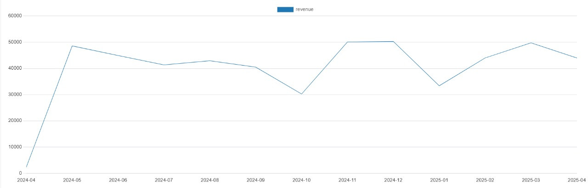
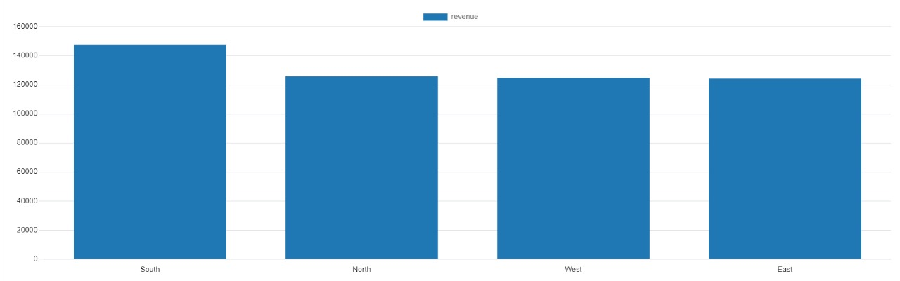

# 📈 Task 6 - Sales Trend Analysis Using PostgreSQL

## 🧠 Objective
Analyze online sales trends using SQL aggregation, focusing on monthly revenue, volume, and regional performance.

## 🛠 Tech Stack
- PostgreSQL
- pgAdmin / DBeaver for query execution and CSV export

## 📂 Dataset Overview
Generated synthetic but realistic data:
- 1000 records across 1 year
- 50 unique products
- 200 customers
- 4 sales regions

## 📊 Key Metrics Analyzed
- Monthly revenue and order volume
- Top 3 months by sales
- Average order value per month
- Monthly revenue growth
- Regional revenue breakdown

## 📤 Files Included

## 📂 Dataset Overview

| File           | Description                                  |
|----------------|----------------------------------------------|
| `orders.csv`   | Generated raw sales data (1000 records)      |

- **Features**: 
  - `order_id`, `product_id`, `customer_id`, `order_date`, `amount`, `region`
  - Simulates 1 year of online orders across 4 regions and 200+ customers

---

## 🛠 PostgreSQL Queries

| Query File                      | Description                                 |
|---------------------------------|---------------------------------------------|
| `create_and_insert_orders.sql`  | SQL script for data generation              |
| `monthly_revenue_volume.sql`    | Total revenue and order count by month      |
| `top_3_months.sql`              | Top 3 months with highest revenue           |
| `avg_order_value.sql`           | Monthly average order value                 |
| `revenue_growth.sql`            | Month-over-month revenue growth             |
| `revenue_by_region.sql`         | Regional revenue and order distribution     |

---

## 📊 Query Results

| Output File                         | Description                                  |
|-------------------------------------|----------------------------------------------|
| `monthly_revenue_volume.csv`        | Revenue + orders per month                   |
| `top_3_months.csv`                  | Best performing months by sales              |
| `avg_order_value.csv`               | Monthly average order value                  |
| `revenue_by_growth.csv`                | MoM revenue growth %                      |
| `revenue_by_region.csv`             | Revenue + orders per region                  |

---

## 📈 Charts (via pgAdmin / DBeaver)

### Monthly Revenue Line Chart

### Revenue by Region Bar Chart

---

## 🚀 Highlights
- Uses PostgreSQL window functions
- Professional dataset design with variability
- Extra analyses to go beyond task requirements
